# 📘 DOCUMENTO DI STUDIO COMPLETO — LIVELLO HOST‑TO‑NETWORK (H2N)  
*(rielaborato in italiano, completo, studiabile, con mappe e schemi)*

---

# **1. Introduzione al livello Host‑to‑Network (H2N)**

Il livello **Host‑to‑Network (H2N)** è il livello più basso della pila protocollare TCP/IP.  
Si occupa di:

- collegare fisicamente due o più dispositivi;
- gestire la trasmissione dei dati tra host direttamente connessi;
- definire protocolli e tecnologie di accesso al mezzo.

È il livello che “aggancia” l’host alla rete.

---

# **2. Posizione del livello H2N nella pila protocollare**

```
+------------------+
|   Applicazione   |
+------------------+
|     Trasporto    |
+------------------+
|      Rete        |
+------------------+
| Host-to-Network  |
+------------------+
```

Il livello H2N fornisce servizi al livello IP, che a sua volta fornisce servizi al livello di trasporto.

---

# **3. Scopo del livello H2N**

Il livello H2N affronta problemi fondamentali:

### **Interconnessione tra host**
- come collegare fisicamente due dispositivi;
- quali cavi, frequenze, connettori, segnali usare.

### **Trasmissione dei dati**
- come incapsulare i dati in frame;
- come accedere al mezzo condiviso;
- come gestire errori, ritrasmissioni, flusso.

### **Dipendenza reciproca**
La scelta della tecnologia fisica **impone** la scelta del protocollo di trasmissione, e viceversa.

---

# **4. Esempi di tecnologie H2N**

### **LAN cablate**
- Ethernet (standard di fatto)
- Token Ring
- FDDI
- Frame Relay

### **LAN wireless**
- IEEE 802.11 (a/b/g/n/ac/ax)

### **Connessioni seriali**
- SLIP
- PPP

---

# **5. Servizi possibili del livello H2N**

## **Livello 1 – Fisico**
- tipo di mezzo (rame, fibra, radio);
- connettori e pinout;
- tensioni, frequenze, lunghezze d’onda.

## **Livello 2 – Data Link**
- framing (incapsulamento dei frame);
- accesso al mezzo (CSMA/CD, CSMA/CA…);
- consegna affidabile (ACK, ritrasmissioni);
- controllo di flusso;
- rilevazione/correzione errori;
- half‑duplex / full‑duplex.

> **Nota:** non tutte le tecnologie implementano tutti questi servizi.

---

# **6. Differenze con altri livelli**

## **H2N vs Trasporto**
- H2N → funziona **su un singolo link**  
- Trasporto → funziona **end‑to‑end**

## **H2N vs IP**
- H2N → consegna **solo nella stessa LAN**  
- IP → consegna **ovunque su Internet**

---

# **7. Tipi di connessione**

## **Broadcast**
Molti host condividono lo stesso canale.  
Serve un protocollo di accesso (CSMA/CD, CSMA/CA).

## **Point‑to‑point**
Un solo mittente e un solo destinatario.  
Tipico tra router o modem‑router.

---

# **8. Modalità di trasmissione**

- **Unicast** → uno a uno  
- **Multicast** → uno a molti (gruppo)  
- **Anycast** → uno a uno (il più vicino del gruppo)  
- **Broadcast** → uno a tutti

---

# **9. Adattatori di comunicazione (NIC)**

Una **Network Interface Card (NIC)** implementa il protocollo H2N.

Componenti tipici:
- RAM interna  
- DSP (Digital Signal Processor)  
- interfaccia bus/host  
- interfaccia di rete  

La NIC è **semi‑autonoma**: gestisce parte della comunicazione senza coinvolgere la CPU.

---

# **10. LAN (Local Area Network)**

Una LAN è una rete locale con:
- area fisica limitata (edificio, campus);
- alta velocità (100 Mbps, 1 Gbps, 10 Gbps);
- mezzo condiviso.

---

# **11. Tecnologie LAN (IEEE 802)**

- **802.3 Ethernet** (standard dominante)
- Token Ring
- FDDI
- Frame Relay
- **802.11 WLAN**

---

# **12. Accesso a Internet da una LAN**

La LAN aziendale/universitaria è collegata a Internet tramite un router.  
Gli host → switch/bridge → router → Internet.

---

# **13. Ethernet**

Ethernet nasce negli anni ’70 (Bob Metcalfe).  
In origine era un **bus condiviso** con un unico canale.

### **Perché ha avuto successo?**
- economico;
- flessibile (topologie e mezzi diversi);
- compatibile con TCP/IP;
- diffusione rapida → ha “bloccato” concorrenti (FDDI, ATM).

---

# **14. Caratteristiche di Ethernet**

### **Tipo di connessione**
Broadcast: tutti ricevono ciò che uno trasmette.

### **Modalità di trasmissione**
Broadcast: un mittente → tutti i nodi.

---

# **15. MAC Address**

Ogni NIC ha un **MAC address** a 48 bit, unico e permanente.

Struttura:
- **OUI (24 bit)** → produttore  
- **NIC ID (24 bit)** → identificativo univoco

Broadcast MAC: **FF‑FF‑FF‑FF‑FF‑FF**

---

# **16. Perché non usare l’IP come indirizzo fisico?**

- non supporterebbe protocolli non‑IP;
- richiederebbe configurazione continua;
- genererebbe troppi interrupt;
- renderebbe impossibile usare altre tecnologie H2N.

---

# **17. Ethernet Frame**

```
+----------+----------+----------+--------+-----------+------+
| Preamble | Dest MAC | Src MAC  | Type   |   Data    | CRC  |
+----------+----------+----------+--------+-----------+------+
```

---

# **18. Preamble**

8 byte:
- 7 byte = 10101010 (sincronizzazione)
- 1 byte = 10101011 (inizio frame)

---

# **19. Destinazione e sorgente**

- 6 byte ciascuno  
- se il MAC di destinazione coincide → il frame viene accettato  
- altrimenti scartato

---

# **20. Type**

Indica quale protocollo di livello rete deve ricevere il frame:
- IP
- ARP
- RARP
- altri protocolli (IPX, AppleTalk)

---

# **21. Campo Data**

- contiene il datagramma IP  
- MTU = 1500 byte  
- minimo = 46 byte (padding se necessario)  
- jumbo frame = 9000 byte

---

# **22. CRC**

Cyclic Redundancy Check (4 byte):
- rileva errori nei bit del frame;
- se non coincide → frame scartato.

---

# **23. ARP – Address Resolution Protocol**

Serve a ottenere il **MAC** a partire dall’**IP**.

Funzionamento:
- **Request** → broadcast  
- **Reply** → unicast

Schema:

```
B vuole MAC(D)

B → Broadcast: “Chi ha IP = D?”
D → B: “MAC(D) = xx:xx:xx:xx:xx:xx”
```

---

# **24. ARP Cache**

Ogni host mantiene una tabella temporanea:

| IP | MAC | TTL |
|----|------|------|
| 222.222.222.221 | 88:B2:2F:54:1A:0F | 13:45 |
| 222.222.222.223 | 5C:66:AB:90:75:B1 | 13:52 |

---

# **25. RARP – Reverse ARP**

Serve a ottenere l’**IP** a partire dal **MAC**.  
Usato da host diskless.

---

# **26. Formato ARP/RARP**

Contiene:
- hardware type  
- protocol type  
- hardware size  
- protocol size  
- operazione (request/response)  
- indirizzi mittente/destinatario

---

# **27. Interconnessione di LAN**

Perché non una LAN gigante?

- banda condivisa → saturazione  
- limiti fisici dei cavi  
- collision domain enorme

---

# **28. Dispositivi di rete**

- Hub  
- Bridge  
- Switch  
- Switch L3

---

# **29. Hub**

Dispositivo di livello fisico.

### **Pro**
- economico  
- semplice  
- trasparente  
- isolamento dei guasti

### **Contro**
- non isola collisioni  
- equivale a un bus dal punto di vista del traffico  
- tutte le trasmissioni possono collidere

# Limitazioni generali di Ethernet

Ogni tecnologia Ethernet ha limitazioni relative a:

- **Numero massimo di host** consentiti in un dominio di collisione  
- **Distanza massima** tra due host in un dominio di collisione  
- **Numero massimo di livelli** in uno schema multilivello  

Queste caratteristiche limitano sia:

- il **numero massimo di host collegabili**  
- l'**estensione geografica** di una LAN multilivello  

---

# Bridge

## Dispositivo di livello 2 (link layer)

- **Opera a livello di frame Ethernet**, esaminando l'header dei frame e inoltrandoli in modo selettivo in base all'indirizzo MAC di destinazione.  
- Quando un frame deve essere inoltrato su un segmento LAN, il bridge usa il **protocollo CSMA/CD (con backoff esponenziale)** per trasmettere.

### Confronto con hub

- Un **bridge e piu intelligente di un hub** perche e in grado di leggere l'indirizzo del destinatario all'interno di un frame che lo raggiunge.  
- Un bridge svolge funzioni di **filtraggio**: poiche e in grado di interpretare il MAC di destinazione, invia il pacchetto solo sulla porta di uscita su cui sa che il destinatario e presente.

---

# Confronto tra bridge e hub

*Bridge e hub*

- Hub: mezzo condiviso, singolo dominio di collisione, capacita totale limitata.  
- Bridge/Switch: domini di collisione multipli, inoltro selettivo, throughput totale piu alto.

*(Nel PDF e presente una figura con switch e hub a confronto.)*

| Caratteristica | Hub | Bridge/Switch |
|---|---|---|
| Livello OSI | Livello 1 (fisico) | Livello 2 (collegamento) |
| Dominio di collisione | Unico e condiviso | Separato per porta |
| Inoltro | Ripete su tutte le porte | Inoltro selettivo per MAC |
| Prestazioni aggregate | Limitate | Maggiori |

---

## Vantaggi dei bridge

- **Isola i domini di collisione**  
- **Aumenta il throughput totale massimo**  
- **Non limita** il numero di host o la copertura geografica  
- Puo **connettere diversi tipi di Ethernet** poiche e un dispositivo **store-and-forward**  
- **Trasparente**: non richiede modifiche agli adattatori LAN degli host  

---

## Filtraggio e inoltro dei frame

### Filtraggio dei frame

- I frame destinati a host nello **stesso segmento** **non vengono inoltrati** sugli altri segmenti della LAN.  
- Il meccanismo di filtraggio consente di **aumentare significativamente il traffico utile** in rete.

  - **Assunzione:** in ciascun segmento LAN il traffico e prevalentemente locale (piccola frazione di messaggi broadcast).  
  - La **capacita complessiva disponibile** e pari a quella di ciascun segmento **moltiplicata per il numero di segmenti**.

### Inoltro dei frame

- **Domanda:** come si sa su quale segmento LAN inoltrare un frame?

---

## Metodi di filtraggio e inoltro

I bridge **apprendono** quali host sono raggiungibili attraverso quali interfacce.

- Mantengono **tabelle di filtraggio** costruite automaticamente, senza bisogno dell'intervento degli amministratori di rete.  
- Quando un frame viene ricevuto, il bridge **apprende la posizione del mittente**.  
- **Registra la posizione del mittente** nella tabella di filtraggio.

**Campi della tabella di filtraggio:**

- Indirizzo **MAC** dell'host  
- **Interfaccia** del bridge  
- **Time-To-Live (TTL)** -> periodo di validita delle informazioni memorizzate nella tabella di filtraggio  

Le vecchie voci nella tabella di filtraggio vengono **scartate** alla scadenza del TTL.

---

# Procedura di filtraggio

## Inoltro frame

```text
if frame.destinazione ∈ tabella_filtraggio then
    segmento_dest_lan <- lookup_tabella_filtraggio(frame.destinazione)
    inoltra_su_segmento_lan(frame, segmento_dest_lan)
else
    {invia il frame a tutte le porte tranne quella di ingresso}
    flood(frame)
end if
```

---

# Esempio di autoapprendimento

## Scenario

- **C invia un frame a D**  
- **D risponde** con un frame a C  

### C invia un frame

- Il bridge osserva che **C e sulla porta 1**.  
- Il bridge non ha **informazioni su D** -> inoltra su entrambe le LAN **2 e 3**.  
- Il frame viene **ignorato nella LAN 3**.  
- Il frame viene **ricevuto da D**.

*Esempio bridge*

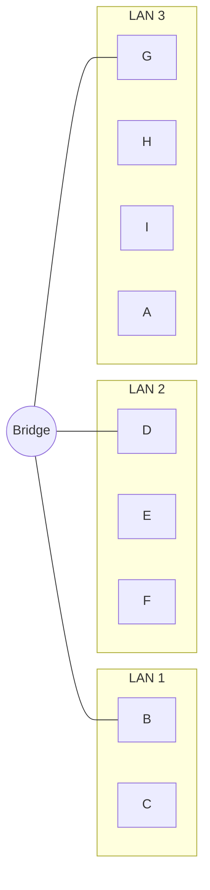

**Tabella di filtraggio (dopo il primo apprendimento):**

| Indirizzo | Porta |
|-----------|-------|
| B         | 1     |
| E         | 2     |
| H         | 3     |
| C         | 1     |

---

## Esempio di autoapprendimento (continua)

### D invia la risposta a C

- Il bridge vede un frame proveniente da **D**.  
- Il bridge rileva che **D e sull'interfaccia 2**.  
- Il bridge sa che **C e sull'interfaccia 1** -> **inoltra selettivamente** il frame tramite l'interfaccia 1.

Se un host **si sposta in un altro segmento LAN**, i pacchetti possono essere inoltrati sul segmento sbagliato finche:

- viene inviato un pacchetto dall'host, oppure  
- **scade il TTL**.

Di solito viene generato traffico quando un host si collega a un bridge.

*Esempio bridge (aggiornato)*


**Tabella di filtraggio (aggiornata):**

| Indirizzo | Porta |
|-----------|-------|
| B         | 1     |
| E         | 2     |
| H         | 3     |
| C         | 1     |
| D         | 2     |

---

### Affidabilita della LAN

- Per aumentare l'**affidabilita** di una rete, e desiderabile avere **ridondanza** o **percorsi alternativi** dalla sorgente alla destinazione.  
- Tuttavia, con percorsi multipli possono crearsi **loop** e di conseguenza i bridge potrebbero **moltiplicare e inoltrare i frame**.  
- **Soluzione:** spanning tree.

---

# Spanning tree

- Lo **spanning tree** e un sottoinsieme della topologia originale che **non contiene cicli**.  
- E possibile organizzare l'architettura **bridge e hub** in uno spanning tree **disabilitando un sottoinsieme di interfacce**.  
- La riattivazione, se necessaria, e una semplice operazione di **riconfigurazione software**.

*(Nel PDF e presente una figura con bridge e hub collegati in una topologia ad albero.)*

---

## LAN con percorsi alternativi

- Lo spanning tree e un sottoinsieme della topologia originale che non contiene cicli.  
- E possibile organizzare l'architettura bridge e hub in uno spanning tree disabilitando un sottoinsieme di interfacce.

*Figura 15.10 Configurazione di bridge e LAN con percorsi alternativi*

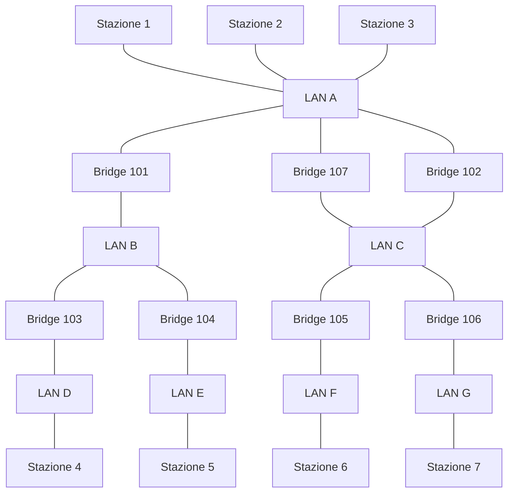

---

# Switch

- Bridge ad alte prestazioni con molte interfacce (es. 8-48).  
- **Inoltro frame di livello 2**.  
- **Filtraggio tramite indirizzi MAC**.  
- Lo switch viene usato con **host singoli** interconnessi in **topologia a stella** tramite lo switch (in alternativa all'hub).

### Caratteristiche degli switch

- Combinazione di interfacce eterogenee (10/100/1000 Mbps) **condivise** e **dedicate**.  
- Fornisce architettura Ethernet **collision-free** (accesso dedicato e full duplex).  
- Traffico simultaneo tra **A-B** e tra **A'-B'**, senza collisioni.

*Esempio di switch Ethernet*

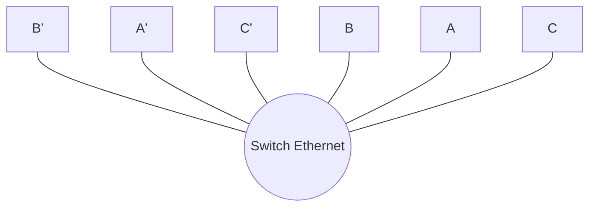

---

## Tipi di commutazione negli switch

### Commutazione store-and-forward

- Il frame viene **ricevuto e verificato** prima dell'inoltro.  
- **PRO:** nessun rischio di inviare frame corrotti (verifica prima dell'inoltro).  
- **CONTRO:** latenza elevata, specialmente quando si attraversano piu switch.

### Commutazione cut-through

- Il frame viene inoltrato dalla porta di ingresso alla porta di uscita dello switch **senza attendere l'arrivo dell'intero frame**.  
- E sufficiente che sia arrivata la parte del frame che contiene l'**indirizzo di destinazione** e che il canale di uscita sia libero.  
- **PRO:** prestazioni migliori.  
- **CONTRO:** possibile inoltro di **frame corrotti** (l'inoltro inizia prima della ricezione del campo CRC).

| Metodo | Come funziona | Vantaggio principale | Svantaggio principale |
|---|---|---|---|
| Store-and-forward | Riceve tutto il frame, controlla e poi inoltra | Maggiore affidabilita | Maggiore latenza |
| Cut-through | Inoltra appena nota la destinazione | Minore latenza | Possibile inoltro di frame corrotti |

---

# Confronto tra hub e switch

*(Figura con confronto della capacita totale)*

- Hub: **capacita totale fino a 10 Mbps** (condivisa tra A, B, C, D).  
- Switch: **capacita totale N x 10 Mbps** (ogni porta puo usare tutta la banda).

---

## Confronto tra bridge e switch

- **Dispositivi concettualmente identici**.  
- Scenario di riferimento tipico:

  - **Switch -> dispositivo hardware**  
  - **Bridge -> sistema software**

### Dove si usano i bridge?

- Nelle **VM** (tra VM / con host).  
- Nei **container** (Docker/Kubernetes).  
- Nei **server** per connettere piu porte fisiche (a livello H2N).  
- Per **separare diverse tecnologie trasmissive** (es. cablato/wireless).

---

# Bridge tra due porte fisiche

Bridge con un host collegato a due segmenti LAN.  
Un bridge che connette due segmenti LAN.

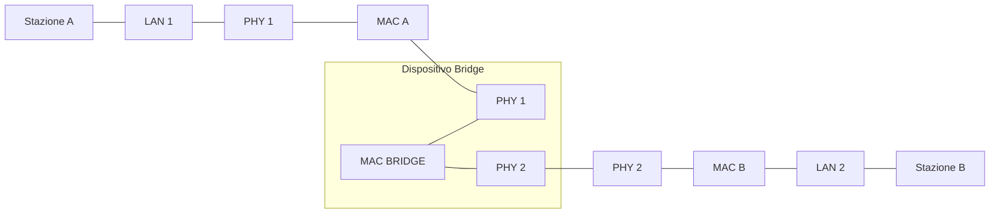

---

## Bridge in Linux

- All'interno di un sistema **Linux** e possibile connettere tra loro piu interfacce di rete.  
- **Vincolo:** indirizzi hardware a 6 byte.  
- Le interfacce possono essere **aggiunte e rimosse in qualsiasi momento**.  
- Un bridge Linux permette di ottenere la **semplicita di inoltro** di uno switch Ethernet insieme a capacita piu avanzate di controllo del traffico, ad esempio:

  - **Filtraggio**  
  - **Traffic shaping (sagomatura del traffico)**

---

## Bridge in Linux - con/senza bridge

**Senza bridge**

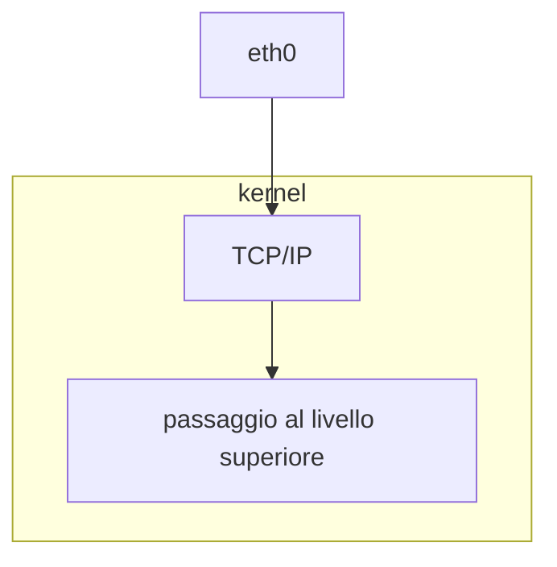

**Con bridge**

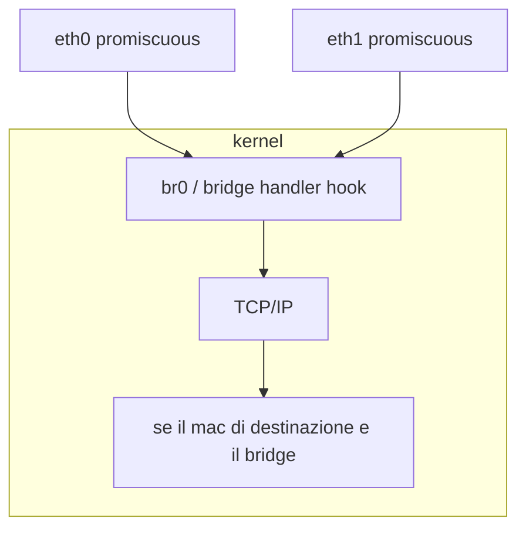

*(Da Linux Conference Japan - 2014)*

---

### Comandi di riferimento

- **Creazione di un bridge**

```bash
brctl addbr <bridge>
ip link add <bridge> type bridge ...
```

- **Aggiunta di interfacce di rete al bridge**

```bash
brctl addif <bridge> <iface>
ip link set <iface> master <bridge>
```

- **Visualizza i bridge attualmente configurati**

```bash
brctl show <bridge>
```

- **Visualizza la lista di indirizzi MAC conosciuti dal bridge**

```bash
brctl showmacs <bridge>
```

---

## Configurazione persistente (esempio Debian)

```text
auto br0

iface br0 inet static
    bridge_ports <iface1> <iface2>
    address <ip-address>
```

---

## Architettura dipartimentale tipica

*Figura 15.14 Configurazione tipica di rete nei locali*

- Switch di livello 3  
- WAN (Gbps)  
- Router  
- Switch di livello 2  
- Host a 10/100 Mbps e wireless (11 Mbps)

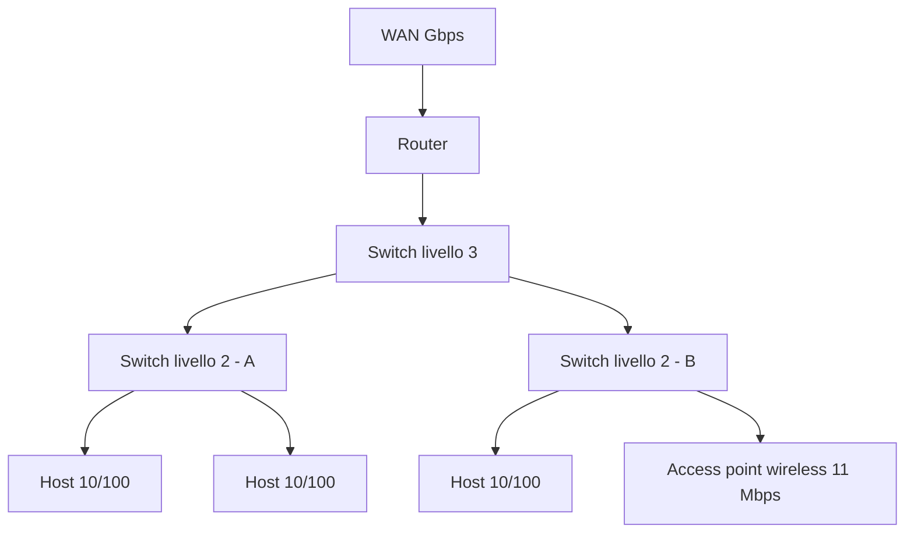

---

# VLAN

## LAN virtuali

- Lo standard **802.1Q (2003)** definisce le specifiche per definire piu **reti locali virtuali (VLAN)** distinte, usando la stessa infrastruttura fisica.  
- Ogni VLAN si comporta come una **rete locale separata** dalle altre.  
- I pacchetti **broadcast** sono confinati all'interno della VLAN.  
- La comunicazione di **livello 2** e confinata all'interno della VLAN.  
- La connettivita tra VLAN diverse puo essere ottenuta solo a **livello 3**, tramite **routing**.  
- Lo standard e definito all'interno del protocollo **802.1D (bridging)** riguardante la comunicazione tra diversi standard 802 tramite bridge.  
- Gli switch Ethernet sono essenzialmente **bridge a protocollo singolo**.

---

## Scopo delle VLAN

L'uso delle VLAN consente di ottenere:

- **Risparmio:** non e necessario creare una nuova infrastruttura LAN con apparati e linee dedicate per creare una nuova LAN parallela nello stesso ambiente della LAN preesistente.  
- **Prestazioni:** il confinamento del traffico broadcast evita la propagazione dei frame verso destinazioni che non devono riceverli.  
- **Sicurezza:** un utente collegato a una VLAN non ha modo di vedere il traffico interno delle altre VLAN.  
- **Flessibilita:** lo spostamento fisico di un utente all'interno degli ambienti coperti dall'infrastruttura di rete puo avvenire senza modifiche della topologia fisica, ma logicamente tramite opportuna riconfigurazione degli apparati di rete (switch o bridge).

---

## Requisiti dei bridge

- Per creare VLAN, gli **switch e bridge** dell'infrastruttura devono essere in grado di **distinguere le diverse VLAN**.  
- I dispositivi devono quindi essere conformi allo **standard 802.1Q**.  
- Esistono diversi modi per creare VLAN:

  - **VLAN basate su porta (private VLAN)**  
  - **VLAN con tag (802.1Q)**  

- Le VLAN devono essere definite all'interno del bridge, con **nome e numero identificativo** per distinguerle tra loro.

---

## Funzioni del bridge in 802.1Q

Tre funzioni che i bridge devono poter svolgere per gestire piu reti virtuali:

- **Ingresso (ingress):** il bridge deve capire a quale VLAN appartiene un frame in ingresso da una porta.  
- **Inoltro (forwarding):** il bridge deve sapere verso quale porta inoltrare il frame verso la destinazione, in funzione della VLAN di appartenenza.  
- **Uscita (egress):** il bridge deve trasmettere il frame in uscita in modo che la VLAN di appartenenza sia interpretata correttamente dagli altri bridge a valle.

---

## VLAN basate su porta (untagged)

- Questa tecnica prevede l'**assegnazione statica** di ciascuna porta del bridge a una VLAN (definita sul bridge).  
- Porte diverse possono essere assegnate a VLAN diverse.  
- In questo modo il bridge viene **partizionato in due o piu bridge logici**.

### VLAN basate su porta - comportamento

- **Ingresso (ingress):** un frame in ingresso appartiene alla VLAN a cui e assegnata la porta.  
  - Non serve usare indicatori di appartenenza sul frame.  
- **Inoltro (forwarding):** il frame puo essere inoltrato solo verso porte appartenenti alla **stessa VLAN** a cui appartiene la porta di ingresso.  
  - Il bridge mantiene un **database di forwarding separato per ogni VLAN**: nessuna stazione appartenente a una VLAN puo essere vista tramite una porta assegnata a VLAN diversa.  
- **Uscita (egress):** una volta determinate le porte attraverso cui trasmettere il frame, esso puo essere trasmesso **cosi com'e**.  
- Le VLAN untagged (dette anche **private**) non richiedono conformita a 802.1Q, ma solo che lo switch supporti la configurabilita.  
- I collegamenti con approccio untagged sono spesso chiamati **access link**.

*(Nel PDF sono presenti esempi grafici di VLAN port-based con host A-H e numeri di porta.)*

---

## VLAN 802.1Q (VLAN con tag)

- Lo **standard 802.1Q** viene usato per poter **condividere lo stesso collegamento fisico** tra VLAN diverse.  
- Per poterlo fare, il bridge deve poter **distinguere la VLAN** a cui appartiene il frame in ingresso.  
- Lo standard definisce una **modifica del formato del frame Ethernet** aggiungendo **4 byte** che trasportano informazioni VLAN (e non solo).  
- Poiche tutti i bridge devono concordare sulla VLAN di appartenenza di un frame, l'**identificatore (VLAN tag)** della VLAN deve essere uguale per tutti i bridge.  
- I collegamenti che seguono un approccio tagged sono chiamati **trunk link**.

---

## Frame Ethernet 802.1Q

Il formato del frame Ethernet secondo lo standard 802.1Q contiene i campi aggiuntivi:

- **TPI (Tag Protocol Identifier):** due byte con valore `81 00` che identificano il frame come frame 802.1Q.  
- **TCI (Tag Control Information):** due byte che trasportano informazioni sul tag.

  - I primi **3 bit (user priority)** indicano il livello di priorita del frame.  
  - Il **quarto bit (CFI)** vale 1 se il frame proviene da una **LAN token ring**.  
  - I restanti **12 bit (VID)** trasportano il **VLAN tag (da 0 a 4095)**.  
  - I valori **0 e 4095** sono riservati e non vanno usati come VLAN ID.

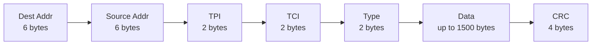

---

### Considerazioni sul framing

- Il frame cosi costituito rappresenta una **violazione dello standard Ethernet**, perche puo superare la dimensione massima di **1518 byte**.  
- Tutti i bridge conformi allo standard devono poter **accettare frame con 2 byte aggiuntivi**.  
- Il campo TPI ha un valore **non usato come tipo protocollo** nei frame Ethernet ordinari.  
- Questo consente di **identificare immediatamente** se un frame e di tipo 802.1Q.  
- Una scheda Ethernet non conforme a 802.1Q **scarterebbe il frame**.

---

## Porte con tag e senza tag

In un bridge 802.1Q tutte le porte devono essere associate a una o piu VLAN.

- Se la porta e associata a una VLAN **port-based (untagged)**, i frame ricevuti da quella porta **non portano il TAG**, ne i frame in uscita dovranno portarlo.  
  - Il collegamento stabilito su queste porte e chiamato **access link**.  
- Altrimenti la porta sara associata a una o piu VLAN in modalita **tagged**, e i frame porteranno le informazioni di tag.  
  - Il collegamento associato a queste porte e chiamato **trunk link**.  
- La VLAN a cui appartiene il frame e definita dal **valore inserito nel TAG**.

---

## Porte ibride

Lo standard richiede che una porta possa essere associata a:

- **una VLAN in modalita untagged**, e  
- **altre VLAN in modalita tagged**.

- Il collegamento stabilito su queste porte e chiamato **hybrid link**.  
- L'appartenenza del frame ricevuto a una VLAN e **definita in modo univoco**:

  - Se **non ha il TAG**, il frame appartiene alla VLAN a cui la porta e associata in modalita **untagged**.  
  - Se **ha il TAG**, la VLAN di appartenenza e definita dal **valore trasportato dal TAG**.

- La VLAN a cui la porta e associata in modalita untagged e anche detta **PVID (Private VLAN ID)**.

| Tipo porta | Tag in ingresso | Tag in uscita | Uso tipico |
|---|---|---|---|
| Access | No | No | Host finali |
| Trunk | Si | Si | Collegamento tra switch/bridge |
| Hybrid | Si/No | Si/No | Casi misti con una VLAN nativa |

---

## Ingresso e inoltro in 802.1Q

**Ingresso (ingress):** quando un frame viene ricevuto, il bridge deve identificare la VLAN di appartenenza.

- Se il frame e **untagged**, la VLAN di appartenenza e identificata con la VLAN a cui la porta e associata in modalita **untagged**.  
- Se il frame e **tagged**, la VLAN di appartenenza e identificata dal **TAG**.

**Inoltro (forwarding):** una volta identificata la VLAN di appartenenza, si applicano le regole di inoltro e si identifica la **porta di uscita**.

- Le porte di uscita devono essere associate alla **VLAN a cui appartiene il frame**.

---

## Uscita (egress): inserimento e rimozione dei TAG

L'egress puo richiedere una **modifica del frame ricevuto**:

- Se il frame in ingresso e **untagged** e la porta di uscita e associata alla VLAN in modalita **untagged**, il frame viene inoltrato **senza modifiche**.  
- Se il frame in ingresso e **802.1Q** e la porta di uscita e in modalita **untagged**, il **TAG deve essere rimosso**.  
- Se il frame in ingresso e di tipo **802.3** e la porta di uscita e associata alla VLAN in modalita **tagged**, il **TAG deve essere inserito**.  
- Negli ultimi due casi, il bridge deve **ricalcolare il valore CRC**.

---

## Coesistenza con dispositivi non 802.1Q

I dispositivi non conformi a 802.1Q verranno collegati su porte del bridge associate **esclusivamente a una VLAN in modalita untagged**.

- Ogni frame ricevuto e garantito essere **associato a una VLAN**.  
- Nessun frame di tipo 802.1Q verra inoltrato al dispositivo a valle, poiche il **TAG deve essere rimosso**.

Questo consente di inserire apparati 802.1Q in una LAN **senza dover sostituire l'hardware preesistente**.

---

## Coesistenza con dispositivi non 802.1Q - host

Di solito le interfacce di rete degli host collegati alla LAN **non sono compatibili** con lo standard 802.1Q.

- La possibilita di usare 802.1Q su una interfaccia dipende sia dalla **scheda** sia dal **driver del sistema operativo**.  
- Tutte le schede moderne installate sui **server** possono lavorare in modalita 802.1Q.  
- Tutte le versioni recenti di **Linux** hanno driver che consentono di usare 802.1Q sulle schede che lo supportano.  
- Su **Windows** non sempre e possibile.

Le connessioni host sono tipicamente **access link**.

---

## Doppia codifica (802.1AD)

- Standard aggiuntivo: **IEEE 802.1AD**.  
- Usato dagli **ISP**.  
- Due livelli di VLAN:

  - **Utente (C-Tag)**  
  - **ISP (S-Tag)**  

- S-Tag gestito solo dall'ISP: **non e mai visibile nelle VLAN del cliente**.  
- La doppia definizione delle VLAN e preservata:

  - **TPID differente** per S-Tag.  
  - C-Tag invariato come nel classico 802.1Q.

*(Nel PDF e presente una tabella con il formato del frame doppio-tag.)*

---

## Esempio di topologia 802.1Q

- **Trunk link** tra i due switch (frame di entrambe le VLAN).  
- I frame ricevuti dalle stazioni entrano **untagged**.  
- I bridge devono **inserire il tag** per trasmettere i frame all'altro bridge.  
- I bridge dovranno **rimuovere il tag** prima di inoltrare i frame alla stazione di destinazione.  
- Nessun frame appartenente a una VLAN puo raggiungere stazioni collegate su porte associate ad altra VLAN.

*(Figura con host A-H e due VLAN su due switch collegati da trunk.)*

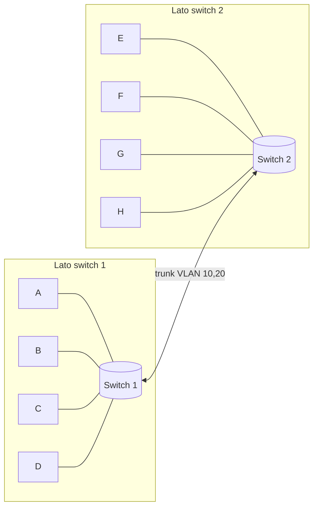

---

## VLAN basate su protocollo

L'assegnazione di un frame a una VLAN puo avvenire **dinamicamente**, in base a vari parametri.

- Le regole di assegnazione devono essere **configurate nei bridge** in modo appropriato.  
- Non tutti i bridge 802.1Q sono in grado di fare assegnazione dinamica, pur essendo conformi allo standard 802.1Q.  
- L'applicazione di queste regole e detta **packet filtering**.

I parametri possono essere:

- **Indirizzo IP del mittente** (se il frame trasporta un pacchetto IP).  
- **Tipo di protocollo** del frame Ethernet (IP, NETBIOS, ...).  
- **Indirizzo Ethernet** della stazione mittente.

---

## VLAN basate su protocollo (continua)

- Queste regole di assegnazione possono anche **coesistere con una assegnazione statica**, che avra **priorita piu alta**.  
- Tuttavia, se il frame ha gia un **tag**, questo ha precedenza sulle altre regole.  
- Alcuni bridge o switch supportano **protocolli proprietari** che consentono di configurare centralmente le regole di assegnazione dinamica su uno o piu server da cui lo switch importa le configurazioni.  
- Un esempio tipico e l'assegnazione basata su **indirizzo MAC**: nessuna stazione puo accedere a una VLAN se il suo MAC non e opportunamente registrato dall'amministratore di rete, indipendentemente dalla porta a cui si collega.

---

## VLAN predefinita

- Gli switch 802.1Q vengono forniti con una **VLAN predefinita** (tipicamente VLAN 1) a cui inizialmente appartengono tutte le porte, fino a riconfigurazione.

---

# Mappe concettuali sintetiche

## Mappa 1: Bridge

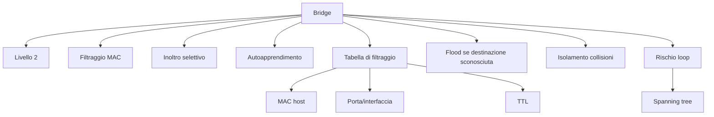

## Mappa 2: Switch

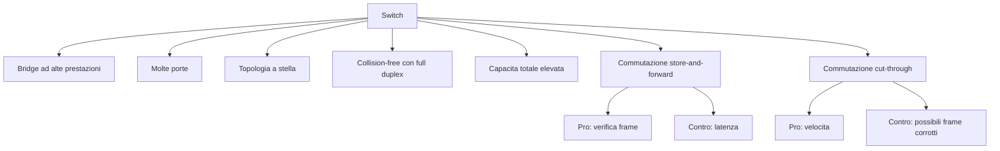

## Mappa 3: VLAN 802.1Q

```mermaid
flowchart TD
  V[VLAN] --> V1[Separazione logica su stessa infrastruttura]
  V --> V2[Broadcast confinato]
  V --> V3[Inter-VLAN solo a livello 3]
  V --> V4[Modalita porte]
  V4 --> V41[Accesso (untagged)]
  V4 --> V42[Trunk (tagged)]
  V4 --> V43[Ibrida (hybrid)]
  V --> V5[Tag 802.1Q]
  V5 --> V51[TPI 0x8100]
  V5 --> V52[TCI]
  V52 --> V521[Priorita 3 bit]
  V52 --> V522[CFI]
  V52 --> V523[VID 12 bit]
  V --> V6[Funzioni bridge]
  V6 --> V61[Ingresso]
  V6 --> V62[Inoltro]
  V6 --> V63[Uscita]
```
