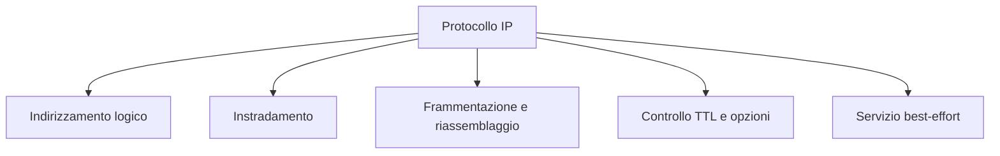
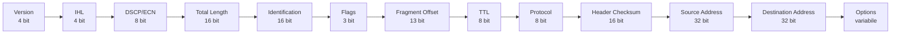
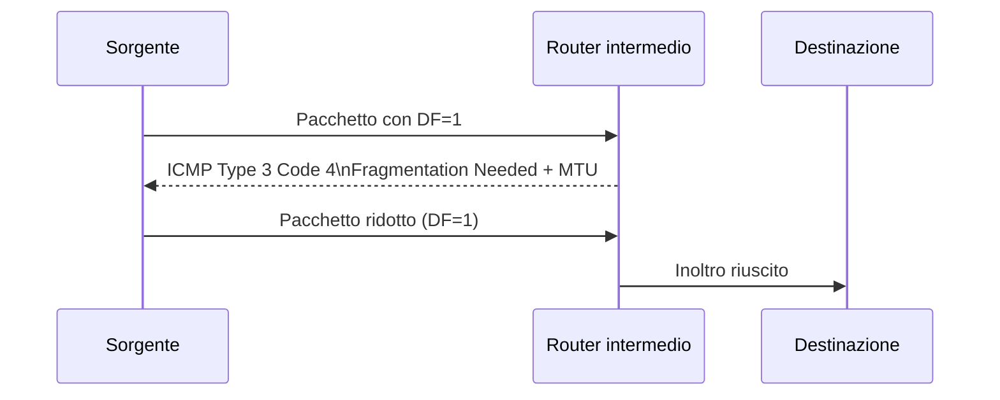
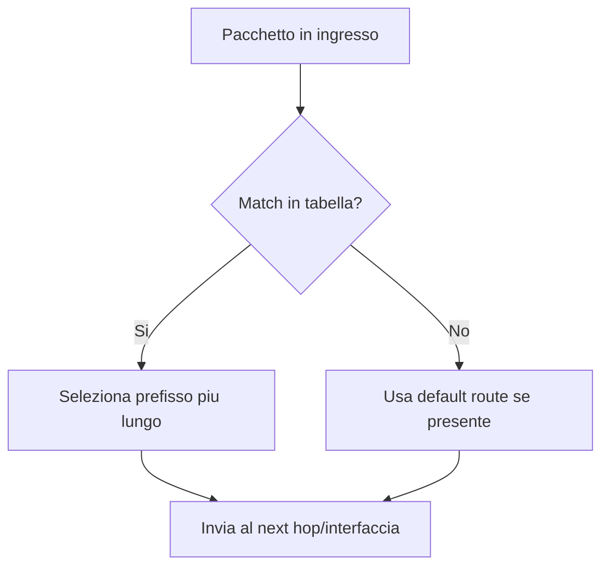
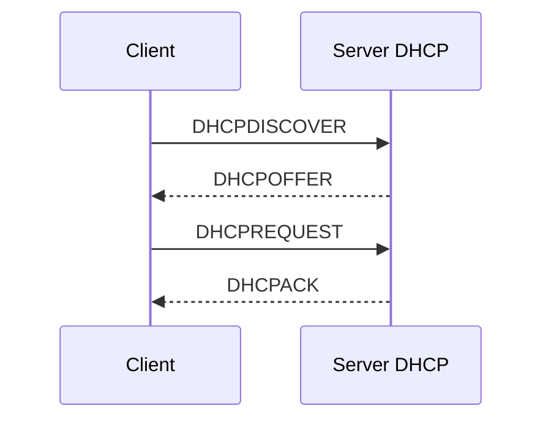
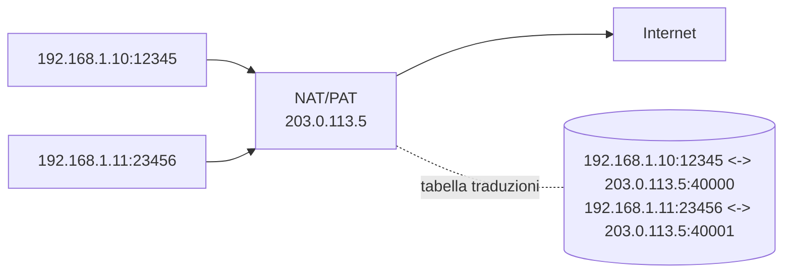

# Protocollo IP — Documento di studio completo (italiano)

## Indice
1. Panoramica e ruolo di IP  
2. Header IPv4: struttura dettagliata  
3. Opzioni IPv4 importanti  
4. Checksum dell’header: come si calcola (esempio)  
5. Indirizzamento IPv4: classi, CIDR, indirizzi speciali  
6. Subnetting: procedure ed esempi risolti  
7. Frammentazione IPv4: meccanismo, calcoli ed esempi  
8. Path MTU Discovery (PMTUD) e problemi pratici  
9. Instradamento: forwarding, routing, tabelle e protocolli (RIP, OSPF, BGP)  
10. ICMP: tipi, uso e diagnostica (ping, traceroute)  
11. DHCP: messaggi, lease e flusso operativo  
12. NAT: tipi, funzionamento e implicazioni applicative  
13. Multicast IPv4 e IGMP (concetti essenziali)  
14. IPv6: panoramica e differenze chiave  
15. Strumenti pratici e comandi utili  
16. Esercizi con soluzioni (subnetting, frammentazione, routing)  
17. Cheat‑sheet (tabelle rapide e formule)

---

## 1 Panoramica e ruolo di IP
**IP (Internet Protocol)** è il protocollo di livello rete che fornisce:
- **indirizzamento logico** (identifica sorgente e destinazione);
- **instradamento** (scelta del percorso tra reti);
- **frammentazione/riassemblaggio** per adattarsi a MTU diverse;
- **meccanismi di controllo** come TTL e opzioni.

Caratteristiche:
- **Connectionless**: ogni datagramma è indipendente.  
- **Best‑effort**: non garantisce consegna, ordine o integrità.

Mappa concettuale rapida:

---

## 2 Header IPv4: struttura dettagliata

Rappresentazione del layout header (ordine dei campi):

**Campi principali**
- **Version (4 bit)**: 4 per IPv4.  
- **IHL (4 bit)**: Internet Header Length, in parole da 32 bit (min 5 = 20 byte).  
- **DSCP/ECN (8 bit)**: Quality of Service / Explicit Congestion Notification.  
- **Total Length (16 bit)**: lunghezza totale del datagramma (header + payload).  
- **Identification (16 bit)**: identificatore per frammentazione.  
- **Flags (3 bit)**: bit di controllo (Reserved, DF, MF).  
- **Fragment Offset (13 bit)**: offset del frammento in unità di 8 byte.  
- **TTL (8 bit)**: Time To Live, decrementato ad ogni hop.  
- **Protocol (8 bit)**: indica il protocollo del payload (TCP=6, UDP=17, ICMP=1, ecc.).  
- **Header Checksum (16 bit)**: checksum calcolato solo sull’header.  
- **Source / Destination (32 bit)**: indirizzi IPv4.  
- **Options**: variabile, presente se IHL > 5.

---

## 3 Opzioni IPv4 importanti
Le opzioni sono rare ma esistono e possono essere usate per scopi diagnostici o di controllo.

Esempi:
- **Record Route (RR)**: chiede ai router di registrare il proprio indirizzo nel campo opzioni (limitate dimensioni).  
- **Timestamp**: registra timestamp dei router attraversati.  
- **Security** (storica): informazioni di sicurezza (raramente usata).  
- **Source Route (Strict/Loose)**: indica un percorso obbligato o preferito (usata raramente per motivi di sicurezza).

**Nota**: l’uso di opzioni può penalizzare le prestazioni e spesso è bloccato dai router.

---

## 4 Checksum dell’header: come si calcola (esempio)
Il checksum IPv4 è una somma a 16 bit con complemento a uno sull’header (con campo checksum impostato a 0 durante il calcolo).

**Procedura sintetica**
1. Dividi l’header in parole da 16 bit.  
2. Somma tutte le parole con overflow a 16 bit (wraparound).  
3. Prendi il complemento a uno del risultato → valore checksum.

**Esempio rapido**
Header (parole 16 bit, valori esemplificativi): `0x4500`, `0x0034`, `0x1c46`, `0x4000`, `0x4006`, `0x0000`, ...  
Somma, wraparound, complemento → checksum.

---

## 5 Indirizzamento IPv4: classi, CIDR, indirizzi speciali

**Notazione**: `a.b.c.d/n` (CIDR).

**Indirizzi speciali**
- **0.0.0.0**: indirizzo non specificato (usato in boot/DHCP).  
- **127.0.0.0/8**: loopback (127.0.0.1).  
- **Broadcast locale**: indirizzo con tutti i bit host a 1 (es. `192.168.1.255` per /24).  
- **Indirizzi privati (RFC 1918)**: `10.0.0.0/8`, `172.16.0.0/12`, `192.168.0.0/16`.  
- **Link‑local**: `169.254.0.0/16` (assegnazione automatica se DHCP fallisce).  
- **Multicast**: `224.0.0.0/4`.  
- **Reserved / Experimental**: `240.0.0.0/4`.

**CIDR e aggregazione**
- `192.0.2.0/24` è un blocco; per aggregare due /24 contigui si può creare un /23 se i bit di rete lo permettono.

---

## 6 Subnetting: procedure ed esempi risolti

**Procedura**
1. Determina il numero di host richiesti.  
2. Calcola il numero di bit host necessari: \(h = \lceil \log_2(host\_richiesti + 2) \rceil\).  
3. Prefisso = \(32 - h\).  
4. Calcola indirizzo di rete e broadcast.

**Esempio 1**  
Richiesti 50 host → \(h = \lceil \log_2(52) \rceil = 6\) → prefisso `/26` → 64 indirizzi → 62 host utilizzabili.

**Esempio 2 — suddividere /24 in /26**
- `192.168.1.0/24` → quattro sottoreti `/26`:
  - `192.168.1.0/26` (hosts .1–.62, broadcast .63)  
  - `192.168.1.64/26` (hosts .65–.126, broadcast .127)  
  - `192.168.1.128/26` (hosts .129–.190, broadcast .191)  
  - `192.168.1.192/26` (hosts .193–.254, broadcast .255)

---

## 7 Frammentazione IPv4: meccanismo, calcoli ed esempi

**Quando avviene**: se il pacchetto è più grande dell’MTU del link successivo e DF=0.

**Regole**
- I frammenti (tranne l’ultimo) devono avere payload multiplo di 8 byte (per l’offset).  
- `Identification` è uguale per tutti i frammenti.  
- `MF=1` per tutti i frammenti tranne l’ultimo.

**Esempio pratico**
Pacchetto originale: **3000 byte** (header 20 B + payload 2980 B).  
Link MTU: **1500 byte** → payload massimo per frammento ≈ 1500 − 20 = 1480 B.  
Payload utile per frammenti (multipli di 8): 1480 → 1480 è multiplo di 8? 1480 / 8 = 185 → sì.

Frammentazione:
- Frammento 1: offset 0, payload 1480, MF=1  
- Frammento 2: offset 185 (1480/8), payload 1480, MF=1  
- Frammento 3: offset 370, payload 20 (2980 − 2960 = 20), MF=0

Tabella riassuntiva dei frammenti:

| Frammento | Payload (B) | Offset (unita da 8 B) | MF |
|---|---:|---:|---:|
| F1 | 1480 | 0 | 1 |
| F2 | 1480 | 185 | 1 |
| F3 | 20 | 370 | 0 |

**Problemi**
- Overhead header per frammento.  
- Se un frammento si perde, l’intero datagramma non può essere ricostruito.  
- Riassemblaggio lato destinazione → memoria e timeout.

---

## 8 Path MTU Discovery (PMTUD) e problemi pratici
**Obiettivo**: evitare frammentazione scoprendo la MTU minima lungo il percorso.

**Meccanismo (IPv4)**
- Mittente invia pacchetti con DF=1.  
- Se un router incontra un link con MTU inferiore, scarta il pacchetto e invia **ICMP Type 3 Code 4** (Fragmentation Needed) al mittente, indicando la MTU del link successivo.  
- Il mittente riduce la dimensione dei pacchetti e riprova.

**Problemi pratici**
- **Firewall che bloccano ICMP** → PMTUD fallisce → connessioni bloccate o lente.  
- Soluzioni: consentire ICMP “Fragmentation Needed” o usare tecniche come **PLPMTUD** (Packetization Layer PMTUD).

Schema operativo PMTUD:

---

## 9 Instradamento: forwarding, routing, tabelle e protocolli

**Forwarding vs Routing**
- **Forwarding**: operazione per pacchetto che usa la tabella di routing per scegliere l’interfaccia/next hop.  
- **Routing**: processo che costruisce la tabella di routing (statico o dinamico).

**Tipi di routing**
- **Statico**: configurato manualmente (semplice, stabile).  
- **Dinamico**: protocolli che scambiano informazioni (adattamento automatico).

**Protocolli principali**
- **RIP (v1/v2)**: distance‑vector, metriche basate su hop count, semplice, limite 15 hop.  
- **OSPF**: link‑state, area OSPF, algoritmo Dijkstra, scalabile per reti aziendali.  
- **BGP**: Border Gateway Protocol, routing inter‑AS, policy‑driven, usato su Internet.

**Esempio di tabella di routing**
| Destinazione | Mask | Next hop | Interfaccia |
|---|---:|---|---|
| 10.0.0.0 | /8 | 10.0.0.1 | eth0 |
| 192.168.1.0 | /24 | — (locale) | eth1 |
| 0.0.0.0 | /0 | 203.0.113.1 | gw0 |

**Longest Prefix Match**: il router sceglie la rotta con il prefisso più lungo che corrisponde all’indirizzo di destinazione.

Mappa decisionale semplificata:

---

## 10 ICMP: tipi, uso e diagnostica

**ICMP (Internet Control Message Protocol)** fornisce messaggi di controllo e errore.

**Messaggi comuni**
- **Echo Request (8)** / **Echo Reply (0)** → `ping`.  
- **Destination Unreachable (3)** → vari codici (network unreachable, host unreachable, port unreachable, fragmentation needed).  
- **Time Exceeded (11)** → usato da `traceroute` (TTL scaduto).  
- **Redirect (5)** → suggerisce un percorso migliore (usato raramente).

**Traceroute (meccanica)**
- Invia pacchetti con TTL incrementale (1,2,3,...).  
- Ogni router che decrementa TTL a 0 invia ICMP Time Exceeded → mittente misura latenza e scopre hop.

**Attenzione**
- ICMP può essere filtrato; alcuni strumenti possono restituire risultati incompleti.

---

## 11 DHCP: messaggi, lease e flusso operativo

**Scopo**: assegnare dinamicamente indirizzi IP e parametri di rete (gateway, DNS).

**Messaggi principali**
- **DHCPDISCOVER** (broadcast)  
- **DHCPOFFER** (server → client)  
- **DHCPREQUEST** (client → server)  
- **DHCPACK** (server → client)  
- **DHCPNAK** (server → client, rifiuto)

**Lease**
- Durata temporale dell’assegnazione.  
- Client rinnova prima della scadenza (REQUEST → ACK).

**Opzioni comuni**
- Router (default gateway), DNS servers, domain name, lease time, subnet mask.

Flusso DORA DHCP:

---

## 12 NAT: tipi, funzionamento e implicazioni

**Network Address Translation (NAT)** traduce indirizzi privati in pubblici.

**Tipi**
- **Static NAT**: mappatura 1:1 tra indirizzo privato e pubblico.  
- **Dynamic NAT**: pool di indirizzi pubblici assegnati dinamicamente.  
- **PAT (NAT Overload)**: più host condividono un singolo IP pubblico tramite porte (porta source translation).

**Funzionamento PAT (esempio)**
- Host A (192.168.1.10:12345) → NAT → 203.0.113.5:40000  
- Router mantiene tabella NAT per tradurre risposte.

**Implicazioni**
- Rompe la trasparenza end‑to‑end (problemi con protocolli che includono indirizzi nel payload).  
- Richiede ALG o traversal techniques per applicazioni P2P/VoIP.

Schema PAT (NAT overload):

---

## 13 Multicast IPv4 e IGMP (concetti essenziali)
**Indirizzi multicast**: `224.0.0.0/4`.  
**IGMP (Internet Group Management Protocol)**: usato dagli host per iscriversi/abbandonare gruppi multicast su una LAN.  
**Routing multicast**: protocolli come PIM (Protocol Independent Multicast) costruiscono alberi di distribuzione.

---

## 14 IPv6: panoramica e differenze chiave
**Motivazione**: spazio indirizzi insufficiente in IPv4.

**Caratteristiche principali**
- Indirizzo a **128 bit** (es. `2001:0db8::1`).  
- Header semplificato (meno campi, estensioni opzionali).  
- Autoconfigurazione (SLAAC), no NAT necessario per indirizzamento globale.  
- Migrazione: dual‑stack, tunneling, traduzioni (NAT64).

Confronto rapido IPv4 vs IPv6:

| Aspetto | IPv4 | IPv6 |
|---|---|---|
| Lunghezza indirizzo | 32 bit | 128 bit |
| Notazione | decimale puntata | esadecimale con : |
| Frammentazione router | Si | No (solo host sorgente) |
| Broadcast | Si | No (usa multicast/anycast) |
| NAT tipico | Molto diffuso | In genere non necessario |

---

## 15 Strumenti pratici e comandi utili

**Linux**
- `ip addr show` → mostra indirizzi.  
- `ip route show` → tabella di routing.  
- `ping <dest>` → verifica raggiungibilità.  
- `traceroute <dest>` → percorso.  
- `tcpdump -i eth0` → cattura pacchetti.  
- `ss -tuln` / `netstat -rn`.

**Windows**
- `ipconfig`  
- `route print`  
- `ping`  
- `tracert`

---

## 16 Esercizi con soluzioni

### Esercizio A — Subnetting
**Domanda**: quanti host utilizzabili in `172.16.5.0/22`?  
**Soluzione**: \(32-22=10\) bit host → \(2^{10}=1024\) indirizzi → 1022 host utilizzabili.

### Esercizio B — Frammentazione
**Domanda**: pacchetto 2500 B (header 20 B), MTU 1400 B. Come frammentare?  
**Soluzione**:
- Payload totale = 2480 B.  
- Payload per frammento = 1400 − 20 = 1380 B → multiplo di 8? 1380/8 = 172.5 → non è multiplo → usare 1376 (172×8).  
- Frammenti:
  - F1: offset 0, payload 1376, MF=1  
  - F2: offset 172, payload 1376, MF=1  
  - Rimanente payload = 2480 − 2752? (attenzione ai calcoli) → ricalcola: 1376×2 = 2752 > 2480 → quindi usare 1376 e poi ultimo con payload 1104? Correggi: meglio calcolare iterativamente:
    - F1: 1376 (offset 0) → rimangono 2480 − 1376 = 1104  
    - F2: 1104 (offset 172), MF=0  
  - F2 payload 1104 è multiplo di 8? 1104/8 = 138 → sì.  
- Risultato: 2 frammenti.

### Esercizio C — Routing table lookup
**Domanda**: dato indirizzo di destinazione `192.168.10.45`, quale rotta scegliere tra:
- `192.168.10.0/24` → eth1  
- `192.168.0.0/16` → eth0  
- `0.0.0.0/0` → gw0  
**Soluzione**: scegliere `192.168.10.0/24` (longest prefix match).

---

## 17 Cheat‑sheet (tabelle rapide e formule)

**Numero indirizzi in una rete**: \(2^{(32-n)}\)  
**Host utilizzabili**: \(2^{(32-n)} - 2\) (salvo eccezioni)  
**Offset unità**: 8 byte (per Fragment Offset)  
**Header IPv4 minimo**: 20 byte (IHL=5)  
**MTU tipiche**: Ethernet = 1500 byte, PPPoE = 1492, Jumbo = 9000

**Protocol numbers**: ICMP=1, TCP=6, UDP=17

Tabella rapida protocolli IP:

| Protocol number | Protocollo |
|---:|---|
| 1 | ICMP |
| 6 | TCP |
| 17 | UDP |
